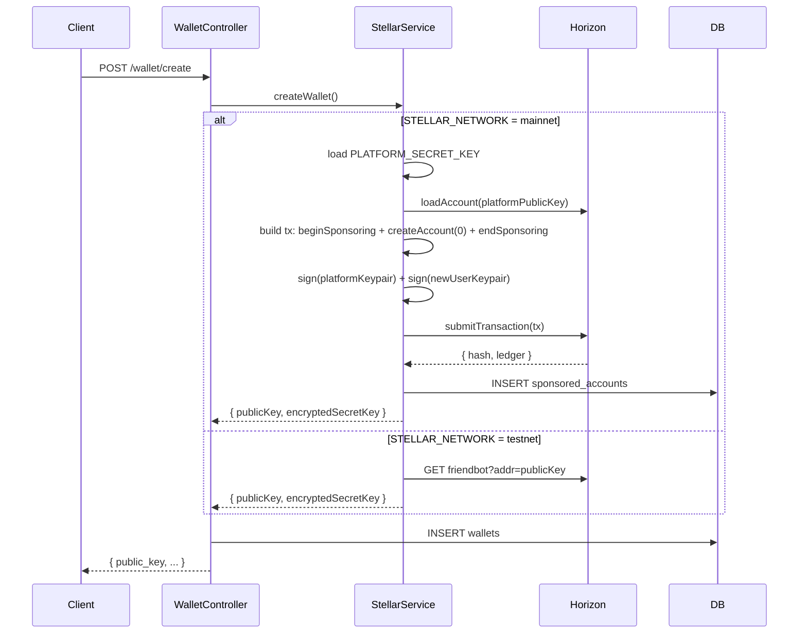

# Design Document: Account Sponsorship

## Overview

This feature implements Stellar's native account sponsorship mechanism so AfriPay's platform account covers the base reserve (currently 1 XLM) for every new user account on mainnet. The change is transparent to API callers — `createWallet` returns the same shape regardless of network. On testnet, Friendbot continues to be used unchanged.

The core Stellar primitive is a three-operation atomic transaction:
1. `beginSponsoringFutureReserves` — platform account declares it will sponsor the next account's reserves
2. `createAccount` — creates the new user account with 0 starting balance
3. `endSponsoringFutureReserves` — closes the sponsorship scope

Both the platform keypair and the new user keypair must sign this transaction.

---

## Architecture



---

## Components and Interfaces

### StellarService — `backend/src/services/stellar.js`

The existing `createWallet()` function is updated to branch on `isTestnet`. A new internal helper `createSponsoredAccount()` handles the mainnet path.

```js
// New internal function — not exported
async function createSponsoredAccount(keypair)
// Returns: { publicKey, encryptedSecretKey, transactionHash }

// Updated existing export
async function createWallet()
// Returns: { publicKey, encryptedSecretKey, transactionHash? }
// transactionHash is present on mainnet only; callers that don't need it are unaffected
```

### WalletController — `backend/src/controllers/walletController.js`

A new `createWallet` handler is added (currently wallet creation is done at registration time in `authController`). The controller calls `stellar.createWallet()` and then writes to both `wallets` and (on mainnet) `sponsored_accounts` via the service.

The controller does **not** need to know which path was taken — the service handles the branching and DB write for `sponsored_accounts` internally.

### Configuration Guard

A module-level check in `stellar.js` (or a dedicated `sponsorship.js` service) validates `PLATFORM_SECRET_KEY` at startup when `STELLAR_NETWORK=mainnet`. This throws synchronously so the process fails fast rather than at first wallet creation.

---

## Data Models

### `sponsored_accounts` table (new migration `012_add_sponsored_accounts.js`)

| Column | Type | Constraints |
|---|---|---|
| `id` | serial | primary key |
| `sponsored_public_key` | text | unique, not null |
| `sponsor_public_key` | text | not null |
| `transaction_hash` | text | not null |
| `reserve_amount` | numeric | not null |
| `status` | text | not null, default `'active'` |
| `created_at` | timestamptz | not null, default `now()` |

Indexes:
- `sponsored_accounts_sponsored_public_key_idx` on `sponsored_public_key`
- `sponsored_accounts_sponsor_public_key_idx` on `sponsor_public_key`

### `wallets` table (unchanged)

The existing `wallets` table schema is reused as-is. The sponsored path writes the same `public_key` and `encrypted_secret_key` columns.

---

## Correctness Properties

*A property is a characteristic or behavior that should hold true across all valid executions of a system — essentially, a formal statement about what the system should do. Properties serve as the bridge between human-readable specifications and machine-verifiable correctness guarantees.*

### Property 1: Platform keypair is loaded from environment variables

*For any* valid Stellar secret key set as `PLATFORM_SECRET_KEY`, the Sponsorship_Service should derive the corresponding public key and use it as the sponsor in the transaction, matching the value of `PLATFORM_PUBLIC_KEY`.

**Validates: Requirements 1.1, 1.2**

---

### Property 2: Mainnet sponsorship transaction structure

*For any* new user keypair, when `STELLAR_NETWORK` is `mainnet`, the constructed Stellar transaction should contain exactly three operations in order — `beginSponsoringFutureReserves`, `createAccount` (with starting balance `"0"`), and `endSponsoringFutureReserves` — and the transaction should carry exactly two signatures (platform keypair and new user keypair).

**Validates: Requirements 2.1, 2.2, 2.3, 6.1**

---

### Property 3: createWallet return value round-trip

*For any* successful call to `createWallet`, the returned `encryptedSecretKey` should decrypt to a valid Stellar secret key whose derived public key matches the returned `publicKey`.

**Validates: Requirements 2.4**

---

### Property 4: Successful sponsorship produces a complete DB record

*For any* successfully submitted sponsorship transaction, the `sponsored_accounts` table should contain exactly one row for the new account's public key, with non-null `sponsor_public_key`, `transaction_hash`, `reserve_amount`, and `status = 'active'`.

**Validates: Requirements 3.1, 3.2, 3.3**

---

### Property 5: Wallet table is written with correct keys

*For any* wallet creation (sponsored or Friendbot), the `wallets` table row for the new user should contain the same `public_key` and `encrypted_secret_key` that `createWallet` returned.

**Validates: Requirements 5.2**

---

### Property 6: Transaction timeout is 30 seconds

*For any* sponsored account creation transaction, the transaction's `timeBounds.maxTime` should be set to `now + 30` seconds, consistent with all other transaction builders in the codebase.

**Validates: Requirements 6.3**

---

## Error Handling

| Condition | Behavior |
|---|---|
| `PLATFORM_SECRET_KEY` missing on mainnet | Throw `ConfigurationError` at startup; `createWallet` is never reached |
| Platform account has insufficient XLM | Horizon returns `op_underfunded`; service throws descriptive error; no `wallets` or `sponsored_accounts` row written |
| Horizon rejects the sponsorship transaction (any reason) | Error propagated to controller; no DB writes |
| Friendbot failure on testnet | Logged as warning (existing behavior); wallet keypair still returned |
| DB write to `sponsored_accounts` fails after confirmed tx | Error propagated; wallet creation fails; operator must reconcile manually (acceptable — Stellar tx is already on-chain) |

---

## Testing Strategy

### Unit / Integration Tests (Jest)

Focus on specific examples and error conditions:

- `createWallet` on mainnet calls `createSponsoredAccount` (mock Horizon)
- `createWallet` on testnet calls Friendbot and skips sponsorship (mock fetch)
- Missing `PLATFORM_SECRET_KEY` on mainnet throws at startup
- Horizon rejection → no `sponsored_accounts` row written
- Insufficient platform balance → no `wallets` row written
- Migration creates table with correct columns and indexes

### Property-Based Tests (fast-check)

Each property test runs a minimum of 100 iterations. Tests are tagged with the property they validate.

**Feature: account-sponsorship**

- **Property 1** — `fc.string()` generates random valid Stellar secret keys; verify derived public key matches env-loaded value.
  Tag: `Feature: account-sponsorship, Property 1: platform keypair loaded from env`

- **Property 2** — `fc.record({ ... })` generates random user keypairs; verify transaction operation types, order, and signature count.
  Tag: `Feature: account-sponsorship, Property 2: mainnet transaction structure`

- **Property 3** — `fc.boolean()` selects network; verify `decryptPrivateKey(encryptedSecretKey)` produces a keypair whose public key equals `publicKey`.
  Tag: `Feature: account-sponsorship, Property 3: createWallet return value round-trip`

- **Property 4** — Generate random transaction hashes and public keys; after a mocked successful submission, query the DB and verify record completeness.
  Tag: `Feature: account-sponsorship, Property 4: successful sponsorship produces complete DB record`

- **Property 5** — For any wallet creation result, verify the `wallets` table row matches the returned keys.
  Tag: `Feature: account-sponsorship, Property 5: wallet table written with correct keys`

- **Property 6** — For any constructed sponsorship transaction, verify `timeBounds.maxTime - timeBounds.minTime <= 30`.
  Tag: `Feature: account-sponsorship, Property 6: transaction timeout is 30 seconds`

Property-based testing library: **fast-check** (already common in Node.js/Jest stacks; install with `npm install --save-dev fast-check`).
