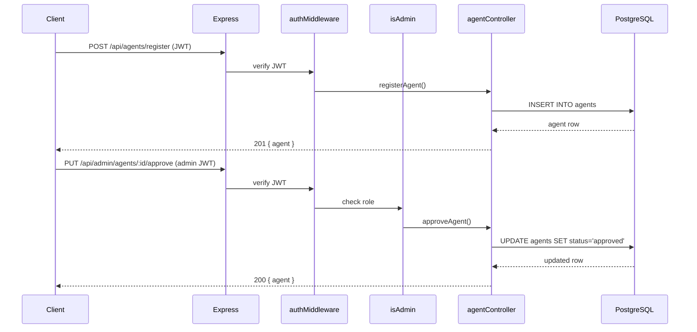

# Design Document: Agent Registration

## Overview

The Agent Registration System adds an agent lifecycle to AfriPay's existing Node.js/Express backend. Agents are approved users who handle fiat payouts in a specific country and currency as part of the escrow-based remittance flow. This design covers the database schema, API surface, middleware chain, controller logic, and testing strategy needed to support agent application, discovery, and admin approval.

The feature slots cleanly into the existing architecture: it follows the same controller/route/middleware pattern already used by `adminController.js`, `authController.js`, and their corresponding route files. No new infrastructure is required.

---

## Architecture

The feature introduces three new files and one database migration:

```
backend/src/
  controllers/agentController.js   — all agent business logic
  routes/agents.js                 — public agent routes (/api/agents)
  routes/adminAgents.js            — admin agent routes (mounted under /api/admin)
database/migrations/
  005_add_agents_table.js          — creates the agents table
```

`app.js` is updated to mount the two new route files.



---

## Components and Interfaces

### Routes

#### `backend/src/routes/agents.js`

Mounted at `/api/agents`.

| Method | Path        | Middleware    | Handler           |
|--------|-------------|---------------|-------------------|
| POST   | `/register` | `auth`        | `registerAgent`   |
| GET    | `/`         | _(none)_      | `listAgents`      |

#### `backend/src/routes/adminAgents.js`

Mounted at `/api/admin` (alongside existing admin routes, sharing the `auth + isAdmin` middleware applied at router level).

| Method | Path                   | Handler         |
|--------|------------------------|-----------------|
| GET    | `/agents`              | `adminListAgents` |
| PUT    | `/agents/:id/approve`  | `approveAgent`  |
| PUT    | `/agents/:id/reject`   | `rejectAgent`   |

The existing `backend/src/routes/admin.js` already applies `router.use(auth, isAdmin)` at the top. The new admin agent routes follow the same pattern in their own router file, then get merged into `app.js` under `/api/admin`.

### Controller: `agentController.js`

```
registerAgent(req, res, next)
listAgents(req, res, next)
adminListAgents(req, res, next)
approveAgent(req, res, next)
rejectAgent(req, res, next)
```

### Validation (express-validator)

Reuses the existing `validate` helper pattern from `routes/auth.js`.

| Field           | Rule                                                    |
|-----------------|---------------------------------------------------------|
| `country`       | `isLength({ min:2, max:2 })`, `isAlpha()`, `toUpperCase()` |
| `currency`      | `isLength({ min:3, max:3 })`, `isAlpha()`, `toUpperCase()` |
| `commission_rate` | `isFloat({ min: 0.0, max: 20.0 })`                   |

---

## Data Models

### `agents` table

```sql
CREATE TABLE agents (
  id              UUID         PRIMARY KEY DEFAULT uuid_generate_v4(),
  user_id         UUID         NOT NULL REFERENCES users(id) ON DELETE CASCADE,
  country         VARCHAR(2)   NOT NULL,
  currency        VARCHAR(3)   NOT NULL,
  commission_rate DECIMAL(5,2) NOT NULL,
  status          VARCHAR(10)  NOT NULL DEFAULT 'pending'
                               CHECK (status IN ('pending', 'approved', 'rejected')),
  created_at      TIMESTAMPTZ  DEFAULT NOW(),
  updated_at      TIMESTAMPTZ  DEFAULT NOW(),
  UNIQUE (user_id),
  CHECK (commission_rate >= 0.00 AND commission_rate <= 20.00)
);

CREATE INDEX idx_agents_country ON agents(country);
CREATE INDEX idx_agents_status  ON agents(status);
```

Migration file: `database/migrations/005_add_agents_table.js` using `node-pg-migrate` style (matching existing migrations).

### API Response Shapes

**Public agent object** (returned by `GET /api/agents`):
```json
{
  "id": "uuid",
  "country": "NG",
  "currency": "NGN",
  "commission_rate": "1.50",
  "created_at": "2024-01-01T00:00:00Z"
}
```
`user_id` is explicitly excluded.

**Admin agent object** (returned by admin endpoints):
```json
{
  "id": "uuid",
  "user_id": "uuid",
  "country": "NG",
  "currency": "NGN",
  "commission_rate": "1.50",
  "status": "pending",
  "created_at": "2024-01-01T00:00:00Z"
}
```

**Paginated admin list**:
```json
{
  "data": [ ...agent objects... ],
  "total": 42,
  "page": 1,
  "limit": 20
}
```

### Status Lifecycle

```
[new application] → pending → approved
                           → rejected
```

Once an agent reaches `approved` or `rejected`, further approve/reject calls return HTTP 409. This is enforced at the application layer (not just the DB constraint) so the error message is descriptive.

---


## Correctness Properties

*A property is a characteristic or behavior that should hold true across all valid executions of a system — essentially, a formal statement about what the system should do. Properties serve as the bridge between human-readable specifications and machine-verifiable correctness guarantees.*

### Property 1: Registration creates a pending agent

*For any* authenticated user who does not already have an agent record, submitting a valid registration request (with a 2-letter country, 3-letter currency, and commission_rate in [0.00, 20.00]) should result in a new agent record with `status = 'pending'` being persisted and returned with HTTP 201.

**Validates: Requirements 1.1**

### Property 2: Duplicate registration is rejected

*For any* user who already has an agent record, a second POST to `/api/agents/register` should return HTTP 409 regardless of the body contents, and the existing agent record should remain unchanged.

**Validates: Requirements 1.2**

### Property 3: Invalid country is rejected

*For any* string that is not exactly 2 alphabetic characters, submitting it as the `country` field should return HTTP 400 and no agent record should be created.

**Validates: Requirements 1.3**

### Property 4: Invalid currency is rejected

*For any* string that is not exactly 3 alphabetic characters, submitting it as the `currency` field should return HTTP 400 and no agent record should be created.

**Validates: Requirements 1.4**

### Property 5: commission_rate range is enforced

*For any* numeric value outside the closed interval [0.00, 20.00], submitting it as `commission_rate` should return HTTP 400. *For any* value within [0.00, 20.00], it should be accepted.

**Validates: Requirements 1.5**

### Property 6: Public listing returns only approved agents, filtered by country when provided

*For any* set of agents with mixed statuses and countries, a GET to `/api/agents` should return only agents with `status = 'approved'`. When a `country` query parameter is provided, the result should be further restricted to agents matching that country. When no parameter is provided, all approved agents are returned.

**Validates: Requirements 2.1, 2.2**

### Property 7: Public listing response excludes user_id and personal data

*For any* approved agent, the objects returned by `GET /api/agents` should contain exactly `id`, `country`, `currency`, `commission_rate`, and `created_at`, and must not contain `user_id` or any other user personal data.

**Validates: Requirements 2.3**

### Property 8: Admin status transition is correct

*For any* agent with `status = 'pending'`, an admin PUT to `/approve` should set `status = 'approved'` and return HTTP 200 with the updated object; an admin PUT to `/reject` should set `status = 'rejected'` and return HTTP 200 with the updated object.

**Validates: Requirements 3.1, 3.2**

### Property 9: Already-decided agent cannot be re-decided

*For any* agent whose `status` is `'approved'` or `'rejected'`, a PUT to either `/approve` or `/reject` should return HTTP 409, and the agent's status should remain unchanged.

**Validates: Requirements 3.4**

### Property 10: Admin listing returns all agents with optional status filter

*For any* set of agents with any statuses, a GET to `/api/admin/agents` without a `status` parameter should return all agents. When a `status` parameter is provided, only agents matching that status should be returned.

**Validates: Requirements 4.1, 4.2**

### Property 11: Admin listing response includes all required fields

*For any* agent record, the objects returned by `GET /api/admin/agents` should contain `id`, `user_id`, `country`, `currency`, `commission_rate`, `status`, and `created_at`.

**Validates: Requirements 4.3**

---

## Error Handling

| Scenario | HTTP Status | Response body |
|---|---|---|
| Missing/invalid JWT | 401 | `{ "error": "No token provided" }` or `{ "error": "Invalid or expired token" }` |
| Non-admin accessing admin route | 403 | `{ "error": "Admin access required" }` |
| Validation failure | 400 | `{ "errors": [ { "msg": "...", "path": "..." } ] }` (express-validator format) |
| Duplicate agent application | 409 | `{ "error": "Agent application already exists" }` |
| Agent not found | 404 | `{ "error": "Agent not found" }` |
| Agent already approved/rejected | 409 | `{ "error": "Agent status cannot be changed" }` |
| Unexpected DB/server error | 500 | `{ "error": "Internal server error" }` (via existing error handler in `app.js`) |

All errors flow through the existing Express error handler in `app.js` for 500-level errors. 4xx errors are returned directly from the controller.

---

## Testing Strategy

### Unit / Integration Tests

Use the existing Jest setup (`backend/tests/`, `backend/src/__tests__/`). Write integration tests that hit the Express app with a real (test) database connection, following the pattern in `backend/tests/auth.test.js`.

Focus unit/integration tests on:
- Specific HTTP status codes for each error scenario (401, 403, 404, 409)
- The exact shape of success responses (field inclusion/exclusion)
- Edge cases: empty approved-agent list returns `[]`, `commission_rate` boundary values (0.00 and 20.00 are valid, -0.01 and 20.01 are not)
- The `status` filter on admin listing with each of the three valid values

### Property-Based Tests

Use **fast-check** (already available in the JS ecosystem, install with `npm install --save-dev fast-check`).

Each property test runs a minimum of **100 iterations**.

Tag format: `// Feature: agent-registration, Property N: <property text>`

| Property | Generator inputs | Assertion |
|---|---|---|
| P1 | `fc.record({ country: fc.stringMatching(/^[A-Z]{2}$/), currency: fc.stringMatching(/^[A-Z]{3}$/), commission_rate: fc.float({ min: 0, max: 20 }) })` | Response is 201, body has `status='pending'`, DB row exists |
| P2 | Same as P1, called twice for same user | Second call returns 409, DB has exactly one row for user |
| P3 | `fc.string()` filtered to NOT match `/^[A-Za-z]{2}$/` | Response is 400 |
| P4 | `fc.string()` filtered to NOT match `/^[A-Za-z]{3}$/` | Response is 400 |
| P5 | `fc.float()` outside [0, 20] | Response is 400; `fc.float({ min: 0, max: 20 })` | Response is 201 |
| P6 | `fc.array(agentArb)` with mixed statuses/countries | GET result contains only approved agents; with country param, only matching country |
| P7 | `fc.array(approvedAgentArb)` | No object in response has `user_id` key |
| P8 | `fc.uuid()` (pending agent id) | After approve → status is 'approved'; after reject → status is 'rejected' |
| P9 | `fc.uuid()` (approved or rejected agent id) | PUT returns 409, status unchanged |
| P10 | `fc.array(agentArb)` with mixed statuses | Without filter: all returned; with status filter: only matching |
| P11 | `fc.array(agentArb)` | Every object has all 7 required fields |

Property tests live in `backend/src/__tests__/agentRegistration.property.test.js`.

### Coverage Targets

- All 5 requirements fully covered
- All 11 correctness properties have a corresponding property-based test
- All error paths covered by at least one integration test example
