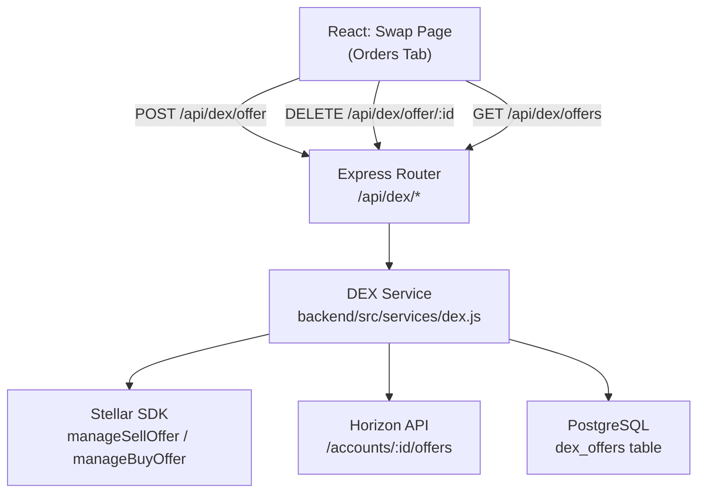

# Design Document: DEX Order Management

## Overview

This feature extends the AfriPay Stellar DEX integration to support limit orders (offers). Users can place sell or buy offers at a specified price, monitor open orders, and cancel them. The implementation extends the existing `dex.js` service and route files rather than creating new ones, adds a `dex_offers` PostgreSQL table for persistence and ownership enforcement, and surfaces open orders in a new Orders tab within the existing Swap page.

The Stellar DEX uses an on-chain order book. Offers are created with `manageSellOffer` or `manageBuyOffer` operations and cancelled by re-submitting the same operation with `amount = 0` and the original `offerId`. The Horizon API provides a read endpoint for querying an account's open offers.

---

## Architecture



The frontend communicates exclusively with the Express API. The DEX service handles all Stellar SDK interactions and database writes. Horizon is queried for live offer data; the local database is the source of truth for ownership checks and status tracking.

---

## Components and Interfaces

### Backend: DEX Service (`backend/src/services/dex.js`)

Three new exported functions are added to the existing module:

```js
/**
 * Place a limit order on the Stellar DEX.
 * @param {object} params
 * @param {string} params.publicKey        - User's Stellar public key
 * @param {string} params.encryptedSecretKey
 * @param {'sell'|'buy'} params.type
 * @param {string} params.sellingAsset     - e.g. "XLM" or "USDC"
 * @param {string} params.buyingAsset
 * @param {string|number} params.amount
 * @param {string|number} params.price     - price ratio (selling/buying)
 * @param {string|number} params.userId    - AfriPay user ID for DB record
 * @returns {{ offerId, type, sellingAsset, buyingAsset, amount, price, status }}
 */
async function createOffer(params) {}

/**
 * Cancel an existing DEX offer.
 * @param {object} params
 * @param {string} params.publicKey
 * @param {string} params.encryptedSecretKey
 * @param {string|number} params.offerId   - Stellar offer ID
 * @param {string|number} params.userId    - for ownership verification
 * @returns {{ offerId, status: 'cancelled' }}
 */
async function cancelOffer(params) {}

/**
 * List offers for a user, optionally filtered by status.
 * Queries Horizon for live data; falls back to DB for cancelled records.
 * @param {string} publicKey
 * @param {'open'|'cancelled'|undefined} status
 * @returns {Array<{ offerId, type, sellingAsset, buyingAsset, amount, price, status }>}
 */
async function listOffers(publicKey, status) {}
```

### Backend: DEX Router (`backend/src/routes/dex.js`)

Three new routes added to the existing router:

| Method   | Path                      | Auth | Description              |
|----------|---------------------------|------|--------------------------|
| `POST`   | `/api/dex/offer`          | ✓    | Create a DEX offer       |
| `DELETE` | `/api/dex/offer/:offerId` | ✓    | Cancel a DEX offer       |
| `GET`    | `/api/dex/offers`         | ✓    | List user's DEX offers   |

Request body for `POST /api/dex/offer`:
```json
{
  "type": "sell",
  "sellingAsset": "XLM",
  "buyingAsset": "USDC",
  "amount": "100",
  "price": "0.12"
}
```

Response for `POST /api/dex/offer` (201):
```json
{
  "offerId": 12345678,
  "type": "sell",
  "sellingAsset": "XLM",
  "buyingAsset": "USDC",
  "amount": "100",
  "price": "0.12",
  "status": "open"
}
```

Response for `DELETE /api/dex/offer/:offerId` (200):
```json
{ "offerId": 12345678, "status": "cancelled" }
```

Response for `GET /api/dex/offers` (200):
```json
[
  {
    "offerId": 12345678,
    "type": "sell",
    "sellingAsset": "XLM",
    "buyingAsset": "USDC",
    "amount": "100",
    "price": "0.12",
    "status": "open",
    "createdAt": "2024-01-15T10:30:00Z"
  }
]
```

### Frontend: Orders Tab (`frontend/src/pages/Swap.jsx`)

A tab switcher is added to the Swap page with two tabs: "Swap" (existing UI) and "Orders" (new). The Orders tab is a self-contained component within the same file.

```
Swap Page
├── Tab bar: [Swap] [Orders]
├── Swap panel (existing, shown when activeTab === 'swap')
└── Orders panel (new, shown when activeTab === 'orders')
    ├── Loading spinner
    ├── Error state with retry button
    ├── Empty state: "No open orders"
    └── Offer list
        └── Offer row: type | selling→buying | amount @ price | date | [Cancel]
            └── Confirmation dialog on cancel click
```

---

## Data Models

### PostgreSQL: `dex_offers` table

Migration file: `database/migrations/012_add_dex_offers_table.js`

```js
exports.up = (pgm) => {
  pgm.createTable('dex_offers', {
    id: { type: 'serial', primaryKey: true },
    user_id: { type: 'uuid', notNull: true, references: 'users(id)', onDelete: 'CASCADE' },
    offer_id: { type: 'bigint', notNull: true },
    offer_type: { type: 'varchar(4)', notNull: true, check: "offer_type IN ('sell', 'buy')" },
    selling_asset: { type: 'varchar(12)', notNull: true },
    buying_asset: { type: 'varchar(12)', notNull: true },
    amount: { type: 'numeric(20,7)', notNull: true },
    price: { type: 'numeric(20,7)', notNull: true },
    status: { type: 'varchar(10)', notNull: true, default: 'open', check: "status IN ('open', 'cancelled')" },
    created_at: { type: 'timestamptz', notNull: true, default: pgm.func('now()') },
    cancelled_at: { type: 'timestamptz' },
  });
  pgm.createIndex('dex_offers', 'user_id');
  pgm.createIndex('dex_offers', 'offer_id');
};

exports.down = (pgm) => {
  pgm.dropTable('dex_offers');
};
```

### Stellar Offer Object (from Horizon)

```js
{
  id: "12345678",                  // Stellar offer ID (string from Horizon)
  selling: { asset_type, asset_code, asset_issuer },
  buying:  { asset_type, asset_code, asset_issuer },
  amount: "100.0000000",
  price: "0.1200000",
  last_modified_ledger: 12345
}
```

### In-memory offer DTO (service layer)

```js
{
  offerId: 12345678,       // number
  type: 'sell',            // 'sell' | 'buy'
  sellingAsset: 'XLM',
  buyingAsset: 'USDC',
  amount: '100.0000000',
  price: '0.1200000',
  status: 'open',          // 'open' | 'cancelled'
  createdAt: '2024-01-15T10:30:00Z'
}
```

---

## Correctness Properties

*A property is a characteristic or behavior that should hold true across all valid executions of a system — essentially, a formal statement about what the system should do. Properties serve as the bridge between human-readable specifications and machine-verifiable correctness guarantees.*

### Property 1: Input validation rejects incomplete requests

*For any* POST /api/dex/offer request body missing one or more of the required fields (`type`, `sellingAsset`, `buyingAsset`, `amount`, `price`), or where `type` is not `"sell"` or `"buy"`, the API should respond with HTTP 400 and an error body identifying the invalid field.

**Validates: Requirements 1.2, 1.3**

---

### Property 2: Offer type determines SDK operation

*For any* valid offer creation request, if `type` is `"sell"` the service SHALL invoke `StellarSdk.Operation.manageSellOffer`; if `type` is `"buy"` the service SHALL invoke `StellarSdk.Operation.manageBuyOffer`. No other operation type is ever submitted.

**Validates: Requirements 1.5, 1.6**

---

### Property 3: Confirmed offer response contains all required fields

*For any* offer that is confirmed by the Stellar network, the HTTP 201 response body SHALL contain `offerId`, `type`, `sellingAsset`, `buyingAsset`, `amount`, `price`, and `status: "open"`, with values matching the original request.

**Validates: Requirements 1.7**

---

### Property 4: Confirmed offer is persisted to the database

*For any* offer confirmed by the Stellar network, querying the `dex_offers` table by the returned `offerId` SHALL return a row with `user_id`, `offer_type`, `selling_asset`, `buying_asset`, `amount`, `price`, `status = "open"`, and a non-null `created_at`.

**Validates: Requirements 1.10, 5.2**

---

### Property 5: Ownership enforcement on cancellation

*For any* authenticated user U and any offer O in the database, if O was created by a different user, a DELETE request from U for O's `offerId` SHALL return HTTP 403 and no Stellar transaction SHALL be submitted.

**Validates: Requirements 2.3, 2.4**

---

### Property 6: Cancellation operation uses amount=0

*For any* valid cancellation request, the Stellar SDK operation submitted SHALL use the original offer's asset pair, `amount = "0"`, and the original `offerId`. This is the Stellar protocol mechanism for cancelling an offer.

**Validates: Requirements 2.6**

---

### Property 7: Cancellation round-trip updates response and database

*For any* offer with status `"open"`, after a successful cancellation confirmed by the Stellar network: (a) the HTTP 200 response SHALL contain `{ offerId, status: "cancelled" }`, and (b) the corresponding `dex_offers` row SHALL have `status = "cancelled"` and a non-null `cancelled_at` timestamp.

**Validates: Requirements 2.7, 2.8, 5.3**

---

### Property 8: List response contains all required fields per offer

*For any* authenticated user with N offers (including N=0), GET /api/dex/offers SHALL return HTTP 200 with a JSON array of length N where each element contains `offerId`, `type`, `sellingAsset`, `buyingAsset`, `amount`, `price`, `status`, and `createdAt`.

**Validates: Requirements 3.4, 3.5**

---

### Property 9: Status filter returns only matching offers

*For any* authenticated user and any `status` query parameter value of `"open"` or `"cancelled"`, GET /api/dex/offers?status=X SHALL return only offers whose `status` field equals X. No offer with a different status SHALL appear in the response.

**Validates: Requirements 3.7**

---

### Property 10: Orders tab fetches offers on activation

*For any* render of the Swap page where the Orders tab is activated, the component SHALL call GET /api/dex/offers exactly once during the activation lifecycle.

**Validates: Requirements 4.2**

---

### Property 11: Offer rows display all required fields

*For any* non-empty list of offers returned by the API, each rendered row in the Orders tab SHALL display the offer type, selling asset, buying asset, amount, price, creation date, and a cancel button.

**Validates: Requirements 4.4, 4.5, 4.6**

---

### Property 12: Cancel confirmation prompt precedes API call

*For any* cancel button click on an offer row, the component SHALL display a confirmation prompt and SHALL NOT submit the DELETE request until the user explicitly confirms. If the user dismisses the prompt, no DELETE request is made.

**Validates: Requirements 4.7**

---

### Property 13: Confirmed cancellation removes offer from UI list

*For any* offer in the displayed list, after the user confirms cancellation and the DELETE request returns success, that offer SHALL no longer appear in the rendered list.

**Validates: Requirements 4.8**

---

## Error Handling

| Scenario | HTTP Status | Response body |
|---|---|---|
| Missing/invalid request field | 400 | `{ errors: [{ msg, path }] }` (express-validator format) |
| No auth token / invalid token | 401 | `{ error: "No token provided" }` |
| Offer belongs to another user | 403 | `{ error: "Offer does not belong to this account" }` |
| Offer not found in DB | 404 | `{ error: "Offer not found" }` |
| Insufficient Stellar balance | 422 | `{ error: "Insufficient balance to place offer" }` |
| Stellar network rejection | 502 | `{ error: "Stellar error", detail: <Stellar result code> }` |
| Horizon API error on list | 502 | `{ error: "Failed to fetch offers from Horizon" }` |

**Stellar error detection**: The existing pattern in `stellar.js` is used — check `err.response?.data?.extras?.result_codes`. The `underfunded` result code maps to 422; all other Stellar errors map to 502.

**DB failure after Stellar confirmation**: If the database write fails after a Stellar transaction is confirmed, the error is logged with the transaction hash and offer ID so it can be reconciled manually. The API still returns the success response to avoid confusing the user (the on-chain state is the source of truth).

**Frontend error states**:
- List fetch failure: full-panel error message with a "Retry" button that re-triggers the fetch.
- Cancellation failure: inline error below the affected offer row; the offer remains in the list.

---

## Testing Strategy

### Unit Tests

Focus on specific examples, edge cases, and error conditions:

- `POST /api/dex/offer` with each required field missing individually → 400
- `POST /api/dex/offer` with `type` set to an invalid value → 400
- `POST /api/dex/offer` without auth token → 401
- `DELETE /api/dex/offer/:offerId` for an offer owned by a different user → 403
- `DELETE /api/dex/offer/:offerId` for a non-existent offer ID → 404
- `POST /api/dex/offer` when Stellar returns `underfunded` → 422
- `GET /api/dex/offers` when Horizon returns an error → 502
- Orders tab renders "No open orders" when API returns empty array
- Orders tab renders error state with retry button on fetch failure
- Orders tab shows loading indicator while fetch is in progress
- Cancellation failure leaves offer in list with inline error

### Property-Based Tests

Use **fast-check** (JavaScript) for all property tests. Each test runs a minimum of **100 iterations**.

Each test is tagged with a comment in the format:
`// Feature: dex-order-management, Property N: <property text>`

| Property | Test description | Generator inputs |
|---|---|---|
| P1 | Any request with a missing/invalid field returns 400 | Random subsets of required fields; random invalid `type` strings |
| P2 | Offer type routes to correct SDK operation | Random `type` values from `['sell', 'buy']`; random asset/amount/price |
| P3 | Confirmed offer response shape is complete | Random valid offer payloads with mocked Stellar confirmation |
| P4 | Confirmed offer is persisted with correct data | Random valid offer payloads; verify DB row matches request |
| P5 | Non-owner cannot cancel any offer | Random user pairs; random offers assigned to one user |
| P6 | Cancellation always submits amount=0 | Random valid offers; verify SDK call parameters |
| P7 | Cancellation updates both response and DB | Random open offers; verify response + DB after cancel |
| P8 | List response shape is complete for any N offers | Random arrays of 0–20 offers from Horizon mock |
| P9 | Status filter returns only matching offers | Random mixed-status offer lists; random filter value |
| P10 | Orders tab calls API on activation | Random component states; verify API call count |
| P11 | Each offer row renders all required fields | Random offer arrays; verify rendered output |
| P12 | Cancel prompt appears before DELETE is sent | Random offer rows; simulate click; verify no API call before confirm |
| P13 | Confirmed cancel removes offer from list | Random offer lists; simulate confirm; verify list length decreases |
