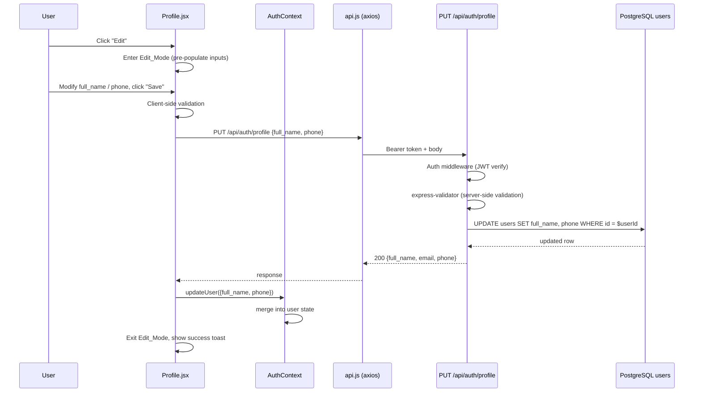

# Design Document: Profile Edit

## Overview

This feature adds inline profile editing to the existing `Profile.jsx` page and a new `PUT /api/auth/profile` backend endpoint. Users can update their `full_name` and `phone` fields; email changes are explicitly blocked at both the UI and API layers.

The implementation is intentionally minimal: no new pages, no new routes files, and no new database tables. The existing `users` table already has `full_name` and `phone` columns with an `updated_at` trigger, so the backend change is a single new controller function and one new route registration.

## Architecture



## Components and Interfaces

### Frontend

#### `Profile.jsx` changes

New state variables added to the existing component:

| State | Type | Purpose |
|---|---|---|
| `isEditing` | `boolean` | Tracks Edit_Mode |
| `formData` | `{full_name, phone}` | Controlled input values |
| `formErrors` | `{full_name?, phone?}` | Inline validation messages |
| `saving` | `boolean` | Disables Save button during request |

New functions:

- `handleEdit()` — sets `isEditing = true`, copies `user.full_name` / `user.phone` into `formData`
- `handleCancel()` — sets `isEditing = false`, clears `formErrors`
- `validateForm()` — returns `false` and populates `formErrors` if inputs are invalid
- `handleSave()` — runs `validateForm()`, calls `PUT /api/auth/profile`, calls `updateUser()`, exits edit mode

The read-only display block and the edit form are rendered conditionally based on `isEditing`.

#### `AuthContext.jsx` changes

A new `updateUser(patch)` function is exposed from the context that merges a partial object into the current `user` state:

```js
const updateUser = (patch) => setUser(prev => ({ ...prev, ...patch }));
```

This is the only change to `AuthContext`.

#### `api.js`

No changes required. The existing axios instance already attaches the JWT bearer token to every request.

### Backend

#### New controller function: `updateProfile` in `authController.js`

```
PUT /api/auth/profile
Authorization: Bearer <token>
Content-Type: application/json

{ "full_name": "Alice Doe", "phone": "+254712345678" }
```

Response (200):
```json
{ "full_name": "Alice Doe", "email": "alice@example.com", "phone": "+254712345678" }
```

The function:
1. Reads `req.user.userId` (set by `authMiddleware`)
2. Trims `full_name`
3. Runs `UPDATE users SET full_name = $1, phone = $2 WHERE id = $3 RETURNING full_name, email, phone`
4. Returns the updated fields

#### Route registration in `auth.js`

```js
router.put('/profile',
  authMiddleware,
  [
    body('full_name').trim().notEmpty().withMessage('Full name is required')
      .isLength({ max: 100 }).withMessage('Full name must be 100 characters or fewer'),
    body('phone').optional({ nullable: true, checkFalsy: true })
      .matches(/^\+?[0-9\s\-(). ]{7,20}$/).withMessage('Invalid phone number format')
  ],
  validate,
  updateProfile
);
```

`email` is never read from the request body, so it is silently ignored.

## Data Models

### `users` table (existing — no migration needed)

| Column | Type | Constraint | Notes |
|---|---|---|---|
| `id` | UUID | PK | |
| `full_name` | VARCHAR(100) | NOT NULL | Editable |
| `email` | VARCHAR(255) | UNIQUE NOT NULL | Read-only via this feature |
| `phone` | VARCHAR(20) | nullable | Editable |
| `updated_at` | TIMESTAMPTZ | auto-trigger | Updated automatically on any UPDATE |

The `updated_at` trigger already exists (`set_users_updated_at`), so no migration is required.

### Client-side user object (AuthContext)

```ts
{
  id: string
  full_name: string
  email: string
  phone: string | null
  wallet_address: string
  pin_setup_completed: boolean
}
```

After a successful save, `full_name` and `phone` are merged in via `updateUser()`.

### Validation rules (shared between client and server)

| Field | Rule |
|---|---|
| `full_name` | Required, non-blank after trim, max 100 chars |
| `phone` | Optional; if provided must match `^\+?[0-9\s\-(). ]{7,20}$` |
| `email` | Not accepted in PUT body (ignored server-side, not shown as editable client-side) |


## Correctness Properties

*A property is a characteristic or behavior that should hold true across all valid executions of a system — essentially, a formal statement about what the system should do. Properties serve as the bridge between human-readable specifications and machine-verifiable correctness guarantees.*

### Property 1: Edit mode pre-populates current values

*For any* authenticated user with a `full_name` and `phone`, when the Profile page enters Edit_Mode, the name input and phone input should contain exactly the user's current `full_name` and `phone` values respectively.

**Validates: Requirements 1.2**

---

### Property 2: Cancel is a no-op round-trip

*For any* user and any arbitrary modifications made to the form inputs while in Edit_Mode, clicking "Cancel" should restore the displayed values to the original user data and make zero API calls.

**Validates: Requirements 1.4**

---

### Property 3: Email is always read-only in edit mode

*For any* user, while Edit_Mode is active, the email field should be non-editable (read-only or disabled) and a note indicating email changes are unsupported should be visible.

**Validates: Requirements 1.5**

---

### Property 4: Blank full_name is rejected client-side

*For any* string composed entirely of whitespace characters (including the empty string), attempting to save it as `full_name` should be rejected by the client — no API call is made and an inline validation error is displayed.

**Validates: Requirements 2.1**

---

### Property 5: Invalid phone format is rejected client-side

*For any* non-empty phone string that does not match `^\+?[0-9\s\-(). ]{7,20}$`, attempting to save should be rejected by the client — no API call is made and an inline validation error is displayed. Conversely, for any phone string that does match the pattern, it should be accepted.

**Validates: Requirements 2.2, 2.3**

---

### Property 6: full_name is trimmed before submission

*For any* `full_name` string with leading or trailing whitespace, the value sent in the PUT request body should be the trimmed version of that string.

**Validates: Requirements 2.4**

---

### Property 7: Valid data triggers the correct API call

*For any* valid `full_name` and `phone` combination, submitting the form should result in exactly one `PUT /api/auth/profile` request whose JSON body contains the trimmed `full_name` and the provided `phone`.

**Validates: Requirements 3.1**

---

### Property 8: API rejects unauthenticated requests

*For any* PUT request to `/api/auth/profile` that is missing a bearer token or carries an invalid/expired token, the API should respond with HTTP 401.

**Validates: Requirements 3.2**

---

### Property 9: Profile update round-trip

*For any* valid `full_name` and `phone`, after a successful `PUT /api/auth/profile`, a subsequent `GET /api/auth/me` for the same user should return the updated `full_name` and `phone` values, and the response body of the PUT itself should contain `full_name`, `email`, and `phone`.

**Validates: Requirements 3.3, 3.4**

---

### Property 10: Email field is ignored by the API

*For any* PUT request body that includes an `email` field alongside valid `full_name` and `phone`, the user's email in the database should remain unchanged after the request succeeds.

**Validates: Requirements 3.5**

---

### Property 11: API rejects invalid inputs with HTTP 400

*For any* PUT request where `full_name` is absent, blank, or exceeds 100 characters, or where `phone` is provided but does not match `^\+?[0-9\s\-(). ]{7,20}$`, the API should respond with HTTP 400 and a body describing the validation errors.

**Validates: Requirements 3.6, 6.1, 6.2, 6.3**

---

### Property 12: API trims full_name before persisting

*For any* `full_name` with leading or trailing whitespace that passes length validation after trimming, the value stored in the database (and returned in the response) should be the trimmed version.

**Validates: Requirements 6.4**

---

### Property 13: Successful save updates context and exits edit mode

*For any* successful API response (HTTP 200), the AuthContext `user` object should be updated with the new `full_name` and `phone`, the Profile page should exit Edit_Mode, and the read-only view should display the updated values.

**Validates: Requirements 4.1, 4.2**

---

### Property 14: Errors preserve edit state and show toast

*For any* non-2xx API response or network error during a save attempt, the Profile page should remain in Edit_Mode, the user's in-progress input should be preserved unchanged, and an error toast with a human-readable message should be displayed.

**Validates: Requirements 5.1, 5.2, 5.3**

---

## Error Handling

| Scenario | Client behaviour | Server behaviour |
|---|---|---|
| Empty / whitespace `full_name` | Inline error, no request sent | — |
| Invalid phone format | Inline error, no request sent | 400 if bypassed |
| Network timeout / offline | Error toast, stay in edit mode | — |
| 400 from server | Error toast with server message, stay in edit mode | Returns `{ errors: [...] }` |
| 401 from server | `api.js` interceptor redirects to `/login` | Returns `{ error: "..." }` |
| 500 from server | Error toast with generic message, stay in edit mode | Express error handler |
| Email in PUT body | — | Silently ignored, not persisted |

The existing `api.js` 401 interceptor already handles token expiry globally, so no additional handling is needed in `Profile.jsx` for that case.

## Testing Strategy

### Unit tests (Jest + React Testing Library)

Focus on specific examples, edge cases, and integration points:

- Render Profile in read-only mode → "Edit" button present, no inputs visible (example for Property 1)
- Render Profile in edit mode → "Cancel" and "Save" buttons present, inputs pre-populated (example for Properties 1, 3)
- Click Cancel after modifying inputs → original values restored, no API call (example for Property 2)
- Submit with empty `full_name` → inline error shown, API not called (example for Property 4)
- Submit with whitespace-only `full_name` → inline error shown (edge case for Property 4)
- Submit with invalid phone → inline error shown (example for Property 5)
- Submit with valid phone → no error (example for Property 5)
- Successful save → toast shown, edit mode exited, values updated (example for Property 13)
- API error → toast shown, edit mode preserved, input preserved (example for Property 14)
- `updateUser` in AuthContext → merges patch into existing user state (unit test for Property 13)

### Property-based tests (fast-check)

Each property test runs a minimum of **100 iterations**. Use `@fast-check/jest` for integration with Jest.

Tag format: `Feature: profile-edit, Property {N}: {property_text}`

| Property | Generator inputs | Assertion |
|---|---|---|
| P4: Blank full_name rejected | `fc.stringOf(fc.constantFrom(' ', '\t', '\n'))` | `validateForm()` returns false, `formErrors.full_name` is set |
| P5: Invalid phone rejected | Strings not matching the phone regex | `validateForm()` returns false for invalid; returns true for valid |
| P6: full_name trimmed | `fc.string()` with leading/trailing spaces prepended | Submitted body `full_name` equals `input.trim()` |
| P9: Update round-trip | `fc.record({ full_name: fc.string(1,100), phone: validPhoneArb })` | PUT then GET returns same values |
| P10: Email ignored | Valid body + arbitrary `email` field | DB email unchanged after PUT |
| P11: Invalid inputs → 400 | Blank names, oversized names, bad phones | Response status is 400 |
| P12: API trims full_name | Names with surrounding whitespace | Stored value equals trimmed input |
| P14: Errors preserve state | Any non-2xx status code | `isEditing` remains true, `formData` unchanged |

**Property-based testing library**: `fast-check` (frontend) and `fast-check` with Jest (backend integration tests).

Each property-based test must include a comment referencing the design property:
```js
// Feature: profile-edit, Property 4: Blank full_name is rejected client-side
test.prop([fc.stringOf(fc.constantFrom(' ', '\t', '\n'))])('blank full_name rejected', (blankName) => { ... });
```
