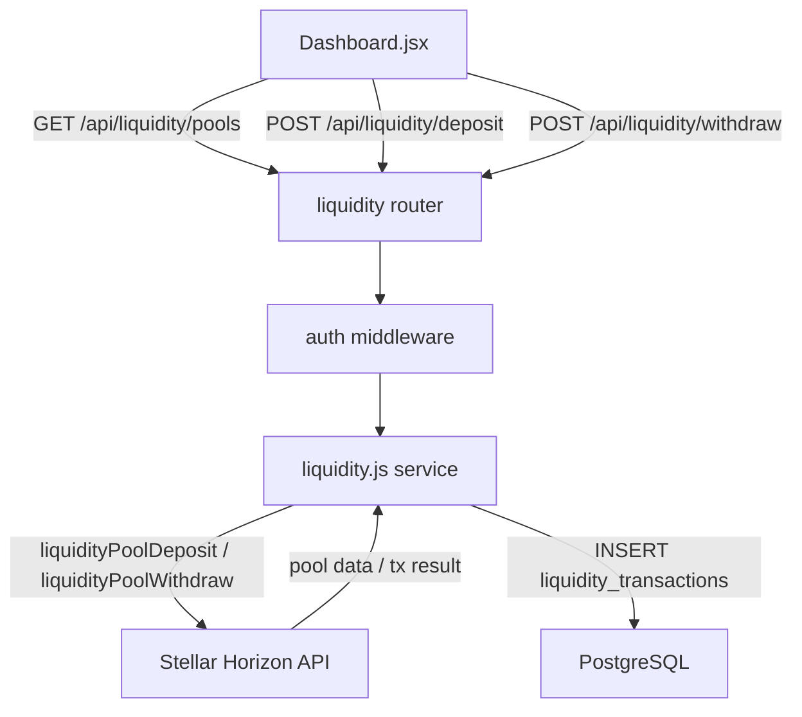

# Design Document: Stellar Liquidity Pool Integration

## Overview

This feature adds Stellar AMM liquidity pool support to AfriPay, allowing users to deposit XLM/USDC into Stellar's on-chain liquidity pools and earn passive income from trading fees. The integration follows the same layered architecture already established in the codebase: a dedicated service (`liquidity.js`) handles all Stellar SDK interactions, an Express router exposes the REST API, a PostgreSQL migration persists transaction records, and the React Dashboard surfaces pool data and user positions.

The Stellar AMM uses a constant-product formula (x * y = k). Pool shares are represented as a special asset type on the Stellar network. APY is derived from the 24-hour fee volume reported by Horizon divided by total pool liquidity, annualised.

## Architecture



The router, service, and database layers are strictly separated. The service never touches HTTP concerns; the router never touches Stellar SDK directly. This mirrors the existing `dex.js` / `routes/dex.js` split.

## Components and Interfaces

### Backend: `backend/src/services/liquidity.js`

Exports:

```js
// Fetch all active XLM/USDC pools from Horizon, compute APY for each
getPools() → Promise<Pool[]>

// Build and submit a liquidityPoolDeposit transaction
deposit({ publicKey, encryptedSecretKey, poolId, maxXlm, maxUsdc }) → Promise<DepositResult>

// Build and submit a liquidityPoolWithdraw transaction
withdraw({ publicKey, encryptedSecretKey, poolId, poolShares }) → Promise<WithdrawResult>

// Persist a confirmed transaction to liquidity_transactions
recordTransaction({ userId, poolId, type, xlmAmount, usdcAmount, poolShares, txHash }) → Promise<void>
```

Reuses `decryptPrivateKey`, `withFallback`, and `withRetry` from `stellar.js`.

### Backend: `backend/src/routes/liquidity.js`

| Method | Path | Auth | Description |
|--------|------|------|-------------|
| GET | `/api/liquidity/pools` | Required | List pools with APY |
| POST | `/api/liquidity/deposit` | Required | Deposit into a pool |
| POST | `/api/liquidity/withdraw` | Required | Withdraw from a pool |

Validation uses `express-validator` matching the pattern in `routes/dex.js`.

### Frontend: `frontend/src/pages/Dashboard.jsx`

A new `LiquiditySection` component (defined in the same file or extracted to `frontend/src/components/LiquiditySection.jsx`) renders:
- Pool list with APY, asset pair, total liquidity
- User share balance and estimated value per pool
- Deposit / Withdraw action buttons
- `ImpermanentLossModal` — shown before any deposit is submitted

### Frontend: `frontend/src/components/ImpermanentLossModal.jsx`

A modal component that:
- Explains impermanent loss in plain language
- Links to Stellar documentation
- Exposes `onConfirm` and `onDismiss` callbacks

## Data Models

### Horizon Pool Response (normalised)

```ts
interface Pool {
  id: string;           // Stellar pool ID (hex)
  assetA: string;       // "XLM"
  assetB: string;       // "USDC"
  totalLiquidity: string; // total_trustlines proxy for liquidity depth
  feeRate: number;      // e.g. 0.003 (30 bps)
  apy: number;          // annualised fee yield, e.g. 0.12 = 12%
}
```

APY formula:
```
apy = (fee_earned_24h / total_reserves_usd) * 365
```
`fee_earned_24h` is derived from `fee_pool` field in Horizon's liquidity pool record multiplied by 24h volume. When Horizon does not expose a direct 24h fee figure, the service falls back to `(total_fee_pool / pool_age_days)` as an approximation.

### API Request / Response Shapes

**POST /api/liquidity/deposit body:**
```json
{ "pool_id": "abc123...", "max_xlm": "100.0", "max_usdc": "50.0" }
```

**POST /api/liquidity/deposit 200 response:**
```json
{ "transaction_hash": "...", "pool_shares": "12.3456789" }
```

**POST /api/liquidity/withdraw body:**
```json
{ "pool_id": "abc123...", "pool_shares": "12.3456789" }
```

**POST /api/liquidity/withdraw 200 response:**
```json
{ "transaction_hash": "...", "xlm_received": "99.8", "usdc_received": "49.9" }
```

### Database: `liquidity_transactions` table

```
id               uuid PRIMARY KEY DEFAULT gen_random_uuid()
user_id          uuid NOT NULL REFERENCES users(id) ON DELETE CASCADE
pool_id          varchar(64) NOT NULL
transaction_type varchar(10) NOT NULL CHECK (transaction_type IN ('deposit', 'withdrawal'))
xlm_amount       decimal(20,7) NOT NULL
usdc_amount      decimal(20,7) NOT NULL
pool_shares      decimal(20,7) NOT NULL
transaction_hash varchar(64) NOT NULL UNIQUE
created_at       timestamp NOT NULL DEFAULT NOW()
```

Indexes: `user_id`, `pool_id`, `created_at DESC`.


## Correctness Properties

*A property is a characteristic or behavior that should hold true across all valid executions of a system — essentially, a formal statement about what the system should do. Properties serve as the bridge between human-readable specifications and machine-verifiable correctness guarantees.*

### Property 1: All liquidity endpoints require authentication

*For any* request to `GET /api/liquidity/pools`, `POST /api/liquidity/deposit`, or `POST /api/liquidity/withdraw` that is missing a valid Bearer token or carries an invalid/expired token, the response status code should be 401.

**Validates: Requirements 1.6, 2.4, 4.4**

---

### Property 2: Input validation rejects requests with missing or invalid fields

*For any* `POST /api/liquidity/deposit` request missing one or more of `pool_id`, `max_xlm`, `max_usdc`, or carrying a non-positive numeric value for amounts, the response status code should be 400 and the body should identify the offending field. The same holds for `POST /api/liquidity/withdraw` missing `pool_id` or `pool_shares`.

**Validates: Requirements 2.2, 2.3, 4.2, 4.3**

---

### Property 3: Confirmed transactions are persisted with all required fields

*For any* deposit or withdrawal that the Stellar network confirms, querying `liquidity_transactions` by the returned `transaction_hash` should yield exactly one row containing the correct `user_id`, `pool_id`, `transaction_type`, `xlm_amount`, `usdc_amount`, `pool_shares`, and a non-null `created_at`.

**Validates: Requirements 2.9, 4.9, 6.2**

---

### Property 4: Pool list response contains all required fields for every pool

*For any* non-empty set of XLM/USDC pool records returned by Horizon, the `GET /api/liquidity/pools` response should be HTTP 200 and every element of the JSON array should contain `id`, `assetA`, `assetB`, `totalLiquidity`, `feeRate`, and `apy`.

**Validates: Requirements 1.3**

---

### Property 5: Successful deposit response contains transaction hash and pool shares

*For any* deposit that the Stellar network confirms, the `POST /api/liquidity/deposit` response should be HTTP 200 and the JSON body should contain a non-empty `transaction_hash` string and a positive `pool_shares` value.

**Validates: Requirements 2.6**

---

### Property 6: Successful withdrawal response contains transaction hash and asset amounts

*For any* withdrawal that the Stellar network confirms, the `POST /api/liquidity/withdraw` response should be HTTP 200 and the JSON body should contain a non-empty `transaction_hash`, a non-negative `xlm_received`, and a non-negative `usdc_received`.

**Validates: Requirements 4.6**

---

### Property 7: Dashboard renders required fields and actions for every pool

*For any* non-empty array of pool data returned by the API, the rendered liquidity section should display each pool's asset pair, APY, and total liquidity, and each pool row should contain both a deposit action and a withdraw action.

**Validates: Requirements 5.3, 5.5**

---

### Property 8: Dashboard displays user share balance for every pool where the user holds shares

*For any* pool in the pool list where the authenticated user's share balance is greater than zero, the rendered liquidity section should display that share balance and a non-zero estimated current value.

**Validates: Requirements 5.4**

---

## Error Handling

| Scenario | HTTP Status | Response body |
|----------|-------------|---------------|
| Missing / invalid auth token | 401 | `{ "error": "No token provided" }` or `{ "error": "Invalid or expired token" }` |
| Missing / invalid request field | 400 | `{ "errors": [{ "msg": "...", "path": "field_name" }] }` |
| Insufficient XLM/USDC balance | 422 | `{ "error": "Insufficient balance for deposit" }` |
| Insufficient pool shares | 422 | `{ "error": "Insufficient pool shares for withdrawal" }` |
| Horizon API error | 502 | `{ "error": "Upstream Stellar error", "detail": "<Horizon message>" }` |
| DB insert failure after confirmed tx | 500 (logged, not surfaced) | Transaction hash logged; Stellar result still returned to caller |

**Stellar error detection** follows the same pattern as `stellar.js`: inspect `err.response?.data?.extras?.result_codes` to distinguish insufficient-balance (`op_underfunded`) from other Stellar rejections.

**DB failure after confirmed Stellar tx**: The service logs the error with `logger.error` including the `transaction_hash` so ops can reconcile manually. The API still returns the successful Stellar result to the user — the Stellar transaction is already on-chain and cannot be rolled back.

## Testing Strategy

### Unit / Integration Tests

Focus on concrete examples and error conditions:

- `GET /api/liquidity/pools` returns 200 with correct shape when Horizon returns data
- `GET /api/liquidity/pools` returns 200 with `[]` when Horizon returns no pools (edge case: 1.4)
- `GET /api/liquidity/pools` returns 502 when Horizon throws (edge case: 1.5)
- `POST /api/liquidity/deposit` constructs `liquidityPoolDeposit` with correct `minPrice` tolerance (10%) (req 2.5)
- `POST /api/liquidity/deposit` returns 422 with correct message on `op_underfunded` (req 2.7)
- `POST /api/liquidity/deposit` returns 502 on other Stellar rejection (req 2.8)
- `POST /api/liquidity/withdraw` constructs `liquidityPoolWithdraw` with `minAmountA/B = 0` (req 4.5)
- `POST /api/liquidity/withdraw` returns 422 with correct message on insufficient shares (req 4.7)
- DB insert failure after confirmed tx logs error with transaction hash (req 6.3)
- Dashboard shows loading skeleton while API call is pending (req 5.2)
- Dashboard shows error message + retry button when pool fetch fails (req 5.6)
- `ImpermanentLossModal` renders explanation text and documentation link (req 3.2)
- Confirming modal triggers deposit API call; dismissing modal does not (req 3.3, 3.4)
- Migration creates `liquidity_transactions` table with all specified columns (req 6.1)

### Property-Based Tests

Uses **fast-check** (already a common choice in JS ecosystems; install with `npm install --save-dev fast-check`). Each test runs a minimum of **100 iterations**.

Tag format: `// Feature: stellar-liquidity-pools, Property {N}: {property_text}`

**Property 1 — Auth required on all endpoints**
Generate arbitrary strings as Bearer tokens (including empty, malformed, expired JWTs). For each, assert all three endpoints return 401.
```
// Feature: stellar-liquidity-pools, Property 1: all liquidity endpoints require authentication
```

**Property 2 — Input validation rejects invalid requests**
Generate deposit request bodies with one or more fields removed or set to invalid values (negative numbers, empty strings, non-numeric). Assert response is always 400 with a field-identifying error.
```
// Feature: stellar-liquidity-pools, Property 2: input validation rejects requests with missing or invalid fields
```

**Property 3 — Transaction persistence round-trip**
Generate random deposit/withdrawal parameters, mock Stellar to return a confirmed result, then query the DB. Assert the inserted row matches all input parameters and the returned transaction hash.
```
// Feature: stellar-liquidity-pools, Property 3: confirmed transactions are persisted with all required fields
```

**Property 4 — Pool list response shape**
Generate arbitrary arrays of Horizon pool records. Assert every element in the normalised response contains `id`, `assetA`, `assetB`, `totalLiquidity`, `feeRate`, and `apy`.
```
// Feature: stellar-liquidity-pools, Property 4: pool list response contains all required fields for every pool
```

**Property 5 — Deposit response shape**
Generate arbitrary confirmed Stellar deposit results. Assert the API response always contains a non-empty `transaction_hash` and a positive `pool_shares`.
```
// Feature: stellar-liquidity-pools, Property 5: successful deposit response contains transaction hash and pool shares
```

**Property 6 — Withdrawal response shape**
Generate arbitrary confirmed Stellar withdrawal results. Assert the API response always contains a non-empty `transaction_hash`, non-negative `xlm_received`, and non-negative `usdc_received`.
```
// Feature: stellar-liquidity-pools, Property 6: successful withdrawal response contains transaction hash and asset amounts
```

**Property 7 — Dashboard pool rendering**
Generate arbitrary arrays of pool objects. Render the `LiquiditySection` component. Assert every pool's asset pair, APY, total liquidity, deposit button, and withdraw button are present in the output.
```
// Feature: stellar-liquidity-pools, Property 7: dashboard renders required fields and actions for every pool
```

**Property 8 — Dashboard user share display**
Generate arbitrary pool arrays where a random subset has a positive user share balance. Render the component. Assert that for every pool with shares > 0, the share balance and estimated value are visible.
```
// Feature: stellar-liquidity-pools, Property 8: dashboard displays user share balance for every pool where the user holds shares
```
